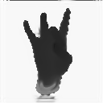
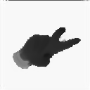
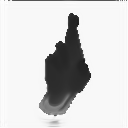
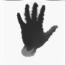
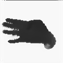
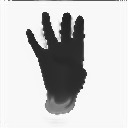

# Simulated+Unsupervised (S+U) learning in TensorFlow
# NYU Hand Dataset

Another TensorFlow implementation of [Learning from Simulated and Unsupervised Images through Adversarial Training](https://arxiv.org/abs/1612.07828).

Thanks to [TaeHoon Kim](http://carpedm20.github.io), I was able to run simGAN that generates refined synthetic eye dataset.  
This is just another version of his code that can generate [NYU hand datasets](http://cims.nyu.edu/~tompson/NYU_Hand_Pose_Dataset.htm).

The structure of the refiner/discriminator networks are changed as it is described in the Apple paper.  
The only code added in this version is ./data/hand_data.py.  
Rest of the code runs in the same way as the original version.  
To set up the environment(or to run UnityEyes dataset), please follow instructions in this [link](https://github.com/carpedm20/simulated-unsupervised-tensorflow)

###Notes
-NYU hand dataset is preprocessed(e.g. background removed)
-Image size set to 128x128
-Buffer/Batch size was reduced due to memory issues
-Local adversarial loss not implemented

##Training Result

Given these synthetic images,

###Test 1

'lambda=0.1' with 'optimizer=sgd' after 4k steps.  

###Test 2

'lambda=0.5' with 'optimizer=sgd' after 4k steps.  

###Test 3

'lambda=1.0' with 'optimizer=sgd' after 4k steps.  

## Author

Seung Shin / [@shinseung428](http://shinseung428.github.io)

