# Simulated+Unsupervised (S+U) learning in TensorFlow
# NYU Hand Dataset

Another TensorFlow implementation of [Learning from Simulated and Unsupervised Images through Adversarial Training](https://arxiv.org/abs/1612.07828).

Thanks to [TaeHoon Kim](http://carpedm20.github.io), I was able to run simGAN that generates refined synthetic eye dataset.  
This is just another version of his code that can generate [NYU hand datasets](http://cims.nyu.edu/~tompson/NYU_Hand_Pose_Dataset.htm).

The structure of the refiner/discriminator networks are changed as it is described in the Apple paper.  
The only code added in this version is ./data/hand_data.py.  
Rest of the code runs in the same way as the original version.  
To set up the environment(or to run UnityEyes dataset), please follow instructions in this [link](https://github.com/carpedm20/simulated-unsupervised-tensorflow).

###Notes
-NYU hand dataset is preprocessed(e.g. background removed)  
-Image size set to 128x128  
-Buffer/Batch size was reduced due to memory issues  
-Changed the size of the refiner/discriminator network

##Results

Given these synthetic images,

###Test 1

'lambda=0.1' with 'optimizer=sgd'  
After 10k steps.  

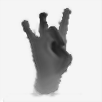
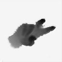

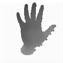
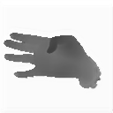
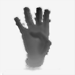

Discriminator Loss  
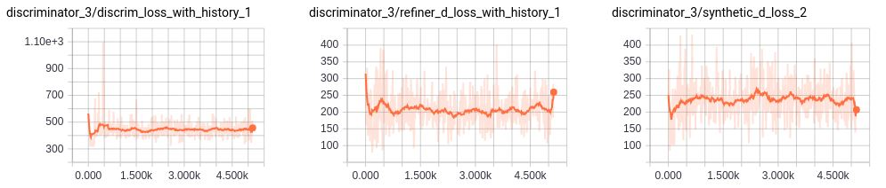

Refiner Loss  
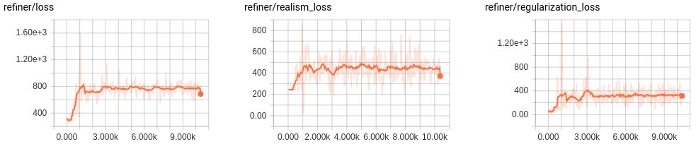

###Test 2

'lambda=0.5' with 'optimizer=sgd'  
After ~10k steps.  

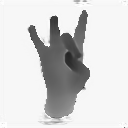

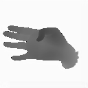
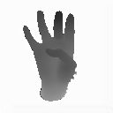

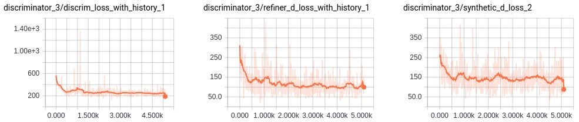

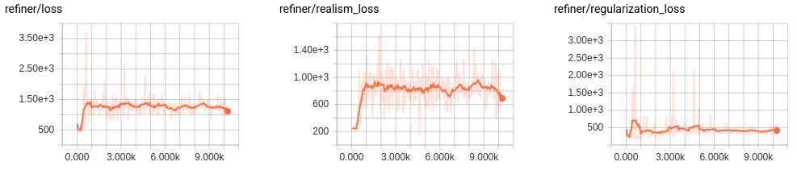

###Test 3

'lambda=1.0' with 'optimizer=sgd' after 10k steps.  

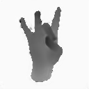

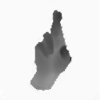

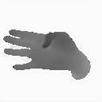
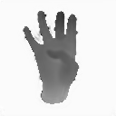

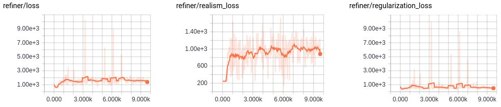

##Summary
Background of the refined images are darker.  
Some of the real image backgrounds were not properly removed while obtaining the arm hand segments from the real dataset.  
When the refiner tries to make refined synthetic images, it also changes the colour of the background to make it look like the ones in the real image dataset.

## Author

Seung Shin / [@shinseung428](http://shinseung428.github.io)

